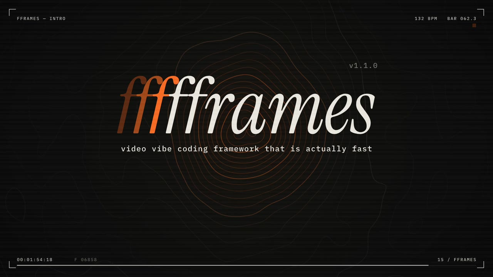

<p align="center">
  <picture>
    <source media="(prefers-color-scheme: dark)" srcset="landing/brand/fframes-wordmark-dark.svg" />
    
  </picture>
</p>

<p align="center">
  <b>Video vibe coding framework that is actually fast.</b><br />
  Write your video in Rust and SVG, render it on the GPU.
</p>

<p align="center">
  <a href="https://crates.io/crates/fframes"></a>
  <a href="https://docs.rs/fframes"></a>
  <a href="./LICENSE.txt"></a>
  <a href="https://x.com/fframes_rust"></a>
</p>

<p align="center">
  <a href="https://fframes.studio"></a>
</p>

<p align="center">
  <sub>This 128 second video was <a href="https://x.com/neogoose_btw/status/2104432561200279774">vibed in 48 minutes and rendered in 36 seconds</a>.<br />
  It is an fframes project: <a href="examples/fframes-intro">examples/fframes-intro</a>.</sub>
</p>

---

## Ask your agent for a video

fframes ships a skill for coding agents. Add it once:

```sh
npx skills add https://fframes.studio
```

Then describe the video you want, the way you would brief a motion designer. The skill takes your agent from an empty
folder to a rendered `.mp4`: it installs fframes, creates a project, designs the motion, places the sound, and checks
the result before handing it to you.

The fframes API is explicit and verbose, and that is [why it stayed unreleased for years](https://x.com/neogoose_btw/status/2104432563146444994).
Writing explicit, verbose code is exactly what an agent with the right skill is good at.

## Built for an author that cannot watch

A coding agent cannot watch a video or hear a soundtrack. Every generated project comes with a command line that turns
a video into things an agent can read: PNGs, text and numbers.

<table>
  <tr>
    <th width="50%">Your agent</th>
    <th width="50%">You</th>
  </tr>
  <tr>
    <td valign="top">
      <b>Checks every frame without rendering pixels.</b><br />
      <code>inspect</code> reports missing fonts or images, text cut off by the canvas, invalid SVG and panics, each with its time and scene.<br /><br />
      <b>Looks at the motion.</b><br />
      <code>strip</code> lays evenly spaced frames out on one contact sheet, <code>onion</code> blends frames to show a movement's path and easing, <code>frame</code> writes full-size PNGs.<br /><br />
      <b>Measures the sound.</b><br />
      <code>audio analyze</code> reports loudness (LUFS), true peak, clipping and silence, per scene.
    </td>
    <td valign="top">
      <b>Watch it in real time, with sound.</b><br />
      <code>preview</code> opens a GPU window to play, pause, seek and step through frame by frame.<br /><br />
      <b>Scrub it in the browser.</b><br />
      The editor runs the video compiled to WebAssembly, with a timeline.<br /><br />
      <b>Ship it.</b><br />
      <code>render</code> writes the final file; <code>render --draft</code> encodes one scene at half size in about a second.
    </td>
  </tr>
</table>

Every command runs as `cargo run --release -- <command>` inside the project:

| command | output |
| --- | --- |
| `timeline` | the scenes with their frame and second ranges, and every audio track with its mix settings |
| `inspect` | problems in a frame every 0.25 s and the first and last frame of every scene; exit code 2 on errors |
| `strip <scene> -n 12` | `strip.png`, a labelled contact sheet |
| `frame <scene>@end,<scene>@50%` | full-size PNGs in `frames/` |
| `onion "<scene>@0..<scene>@1s" -n 6` | `onion.png`, the blended movement |
| `audio analyze --waveform w.png` | the loudness report and a waveform with scene lines and cue ticks |
| `snapshot` | a comparison with approved PNGs, `.diff.png` marks what changed |
| `preview` | the real-time window, for a human |
| `render [--draft]` | the video, or a part of it |

`<scene>` is the name of a scene struct in your video. Times read as `120` (frame), `3.2s`, `50%`, `<scene>@1.2s`, and
ranges like `<scene>@0..<scene>@1s`. Add `--json` to parse the output.

## Why it is fast

- **The GPU draws.** The Skia backend renders on Metal (macOS) or Vulkan (Linux, Windows), about 10x faster than the built-in CPU backend.
- **Static markup is cached.** Parts of a frame without `{expressions}` are hashed at compile time and reused by the renderers.
- **ffmpeg encodes.** fframes links ffmpeg's libav libraries instead of shelling out to a separate tool.
- **Shaders when SVG is not enough.** Run SkSL or pasted Shadertoy GLSL as a layer of any frame.

## What your agent writes

Every frame is an SVG tree returned by a Rust function, written with the `svgr!` macro. From
[examples/hello-world](examples/hello-world/src/hello_world.rs), shortened: a square moves along a timeline and a line
of text prints the current frame.

<details>
<summary><b>Show the code</b></summary>

```rust
impl Video for HelloWorldVideo<'_> {
    const FPS: usize = 30;
    const WIDTH: usize = 1920;
    const HEIGHT: usize = 1080;

    fn duration(&self) -> fframes::Duration<'_> {
        fframes::Duration::Seconds(30.)
    }

    fn audio(&self) -> AudioMap<'_> {
        AudioMap::none()
    }

    fn render_frame(&self, frame: Frame, ctx: &FFramesContext) -> fframes::Svgr<'_> {
        fframes::svgr!(
            <svg
                xmlns="http://www.w3.org/2000/svg"
                viewBox="0 0 1920 1080"
                width={ctx.current_video_size.width}
                height={ctx.current_video_size.height}
            >
                <rect
                    x="400"
                    y="400"
                    width="200"
                    height="200"
                    fill="blue"
                    transform={frame.animate(fframes::timeline!(
                        at 0., animate Transform::translate(0, 0) => Transform::translate(200, 480), Easing::Linear,
                        at 2. => 6.0, animate Transform::translate(200, 480) => Transform::translate(750, -400), Easing::Linear,
                        at 6.0 => 10.0, animate Transform::translate(750, -400) => Transform::translate(1310, 480), Easing::Linear,
                    ))}
                />

                <text
                    x="100"
                    y="440"
                    font-family="JetBrains Mono"
                    font-size="74"
                    font-weight="500"
                    fill="#3b5563"
                >
                    {format!("This frame index: {}, second: {:.2}", frame.index, frame.seconds())}
                </text>
            </svg>
        )
    }
}
```

</details>

The skill's guides are plain Markdown and worth reading as a human too:
[the workflow](skills/fframes-video/SKILL.md), [the API cheat sheet](skills/fframes-video/references/api.md),
[design](skills/fframes-video/references/design.md) and [sound](skills/fframes-video/references/audio.md).
The full API reference is on [docs.rs/fframes](https://docs.rs/fframes).

## Examples

| example | what it shows |
| --- | --- |
| [fframes-intro](examples/fframes-intro) | the 128 second [launch video](https://x.com/neogoose_btw/status/2104432561200279774), everything placed on the beat grid of its soundtrack |
| [signal-lab](examples/signal-lab) | a 24 second motion study: product UI, data storytelling and a technical explainer |
| [motion-graphics](examples/motion-graphics) | spring "punch in" motion and monospace text fitted to its box |
| [shaders](examples/shaders) | GPU shader layers composed with SVG: an SkSL background and a Shadertoy raymarcher clipped into a card |
| [shader-mode](examples/shader-mode) | a 31-second shader promo with reference audio, a moving panel wall, native preview footage and 18 GPU shader programs, rendered with Skia on Metal or Vulkan |
| [neon-triangle](examples/neon-triangle) | a minimal shader clip built to make banding and motion artifacts easy to spot |
| [hello-world](examples/hello-world) | a simple "hello world" video |
| [beta](examples/beta) | a complicated multi-scene example (our beta announce video) |
| [marketing](examples/marketing) | our marketing video |
| [audio-announce](examples/audio-announce) | an automated workflow to create audio visualisation with automated subtitles |
| [podcast](examples/podcast) | an audio visualization for a podcast placeholder video |
| [teej-podcast](examples/teej-podcast) | teej's podcast with video and chapters visualization |
| [tiktok](examples/tiktok) | a TikTok-like vertical video |
| [conference-splash-screen](examples/conference-splash-screen) | one splash screen per conference talk, rendered in batch |
| [low-poly-art](examples/low-poly-art) | a renderer stress test: animal art with a lot of polygons |
| [pixel-memory](examples/pixel-memory) | my dog's memorial video generator (totally randomized) |

From the repository root, `just run podcast` opens an example in the editor with live reload and `just render podcast`
writes it to a file.

## Without an agent

```sh
cargo install --locked cargo-fframes
cargo fframes new my-video
cd my-video && cargo run --release -- preview
```

`cargo fframes new` takes `--template single-scene|multi-scene`, `--format landscape|portrait|square|uhd`, `--fps`,
`--title` and `--backend`. On macOS and Linux (arm64, x86_64) the first build downloads prebuilt Skia and ffmpeg
libraries and takes under a minute on a fast machine; other targets and feature combinations
compile them from source (up to ~20 minutes). Later builds take seconds. `--backend cpu` skips Skia (no preview window, slower renders). To track `main`, install with
`--git https://github.com/dmtrKovalenko/fframes`.

## Requirements

[Rust](https://www.rust-lang.org/learn/get-started) and, for working on the editor, [NodeJS](https://nodejs.org/en/download/).
fframes links ffmpeg's libav libraries statically. A prebuilt build is downloaded for macOS and Linux (arm64 and x86_64) and
compiled from source for other targets or `FFMPEG_FORCE_BUILD=1`; either way the system encoders they link against have to be installed.

The examples enable `fframes/build-portable` on native non-Windows targets. CI builds the
whole workspace, combining the examples' x264, x265, VPX and Opus features; no published
FFmpeg archive currently matches that combination, so it falls back to a source build.
Without `build-portable`, that build uses `-march=native -mtune=native`. Caching it and
restoring it on a runner with a different CPU can cause `SIGILL` (illegal instruction).
The feature omits those flags for source builds while keeping matching prebuilt downloads
enabled, and also applies to FFmpeg used by the compile-time media macro.

Within this workspace, use the same setting for native builds that will be cached or run on
other machines:

```toml
[target.'cfg(not(any(target_arch = "wasm32", windows)))'.dependencies]
fframes = { workspace = true, features = ["build-portable"] }
```

`build-portable` also enables FFmpeg's source-build support, so the examples exclude Windows
(which links a shared FFmpeg installation) and browser targets. Setting `FFMPEG_MARCH` or
`FFMPEG_MTUNE`, even to an empty string, bypasses prebuilt downloads; prefer the feature when
you want portable source fallbacks and prebuilt downloads.

<details>
<summary><b>macOS</b></summary>

```sh
brew install pkg-config ffmpeg x264 x265 opus nasm ninja
```

</details>

<details>
<summary><b>Linux</b></summary>

for debian based distros:
```sh
sudo apt-get install -y yasm nasm ffmpeg libx264-dev libx265-dev libopus-dev libclang-dev clang ninja-build libvpx-dev libasound2-dev
```

for arch based distros:
```sh
sudo pacman -S ninja yasm nasm ffmpeg x264 x265 opus clang
```

for nix users:
```sh
nix-shell
```

</details>

<details>
<summary><b>Windows</b></summary>

On Windows ffmpeg is not compiled from source. Instead fframes links a prebuilt **FFmpeg 9.0** shared build
(for example `ffmpeg-n9.0-latest-win64-gpl-shared-9.0.zip` from [BtbN/FFmpeg-Builds](https://github.com/BtbN/FFmpeg-Builds/releases/tag/latest))
and needs LLVM for bindgen:

```powershell
winget install LLVM.LLVM
# unzip the ffmpeg build somewhere, then point the build to it:
$env:FFMPEG_DIR = "C:\ffmpeg-n9.0-latest-win64-gpl-shared-9.0"
$env:LIBCLANG_PATH = "C:\Program Files\LLVM\bin"
# the ffmpeg DLLs must be reachable when building (proc macros load them) and running
$env:PATH = "$env:FFMPEG_DIR\bin;$env:PATH"
```

`vcpkg install ffmpeg` works as well instead of `FFMPEG_DIR`. Codecs come from the prebuilt build, so leave the
codec features (`h264`, `h265`, ...) off: they request a from-source ffmpeg build which is not supported on Windows.

</details>

<details>
<summary><b>Codecs</b></summary>

Cargo features of the `fframes` crate choose which codecs and hardware acceleration libraries are linked:

```toml
[dependencies]
# this will enable and try to link libx264 during the build
fframes = { version = "1", features = ["h264", "libav-agree-gpl"] }
```

All the build and linking of codecs and other system libs are leveraging the ffmpeg build system, so for
troubleshooting please refer the [ffmpeg compilation guide](https://trac.ffmpeg.org/wiki/CompilationGuide).

</details>

<details>
<summary><b>Troubleshooting</b></summary>

- **Build fails in `ffmpeg-sys-fframes`:** a system library from the list above is missing (`nasm`, `pkg-config`, the codec packages).
- **Build fails in the Skia bindings with a bindgen or libclang error** (only when Skia is compiled from source, e.g. with
  both `metal` and `vulkan` enabled): point `LIBCLANG_PATH` at a working libclang,
  on macOS Xcode's: `export LIBCLANG_PATH=$(xcode-select -p)/Toolchains/XcodeDefault.xctoolchain/usr/lib`.
- **Text renders in the wrong font:** `inspect` reports `No match for ... font-family`; put the font file in the
  project's `media/` folder and use its exact family name.

</details>

## Working on fframes

Agents working on fframes itself should start from [AGENTS.md](AGENTS.md). For humans, install the
[just](https://github.com/casey/just) command runner and init the repo:

```bash
npm install --global pnpm # the package manager for the nodejs based editor
cargo install --locked just cargo-watch wasm-bindgen-cli wasm-pack
just init-repo
just watch-editor # in a separate terminal, to work on the editor
```

## License

fframes is released under the [MIT License](./LICENSE.txt).
