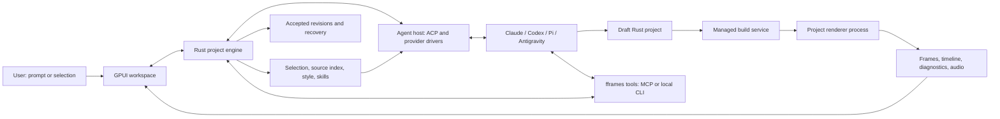

# fframes Studio: research and implementation plan

Research date: 2026-10-01. Working product name: **fframes Studio**.

Build a native GPUI app in Rust where a person describes a video, watches it, selects a scene or visible object, and asks a coding agent to change it. The agent edits an ordinary fframes Rust project. The app owns project setup, style presets, agent connections, compilation, preview, validation, history and export.

This direction follows the requested agent-driven authoring workflow. It supersedes the earlier proposal to make template parameters the primary project model. Templates are useful starting points; Rust source remains the authority for the video.

Read the documents in this order:

1. [Research findings](research.md): what Zeron, Cap, ACP and the current fframes implementation establish, with source references and limitations.
2. [Product and technical architecture](architecture.md): user workflow, process boundaries, project format, selection-to-code retrieval, style presets, preview and recovery.
3. [Implementation plan](implementation-plan.md): ordered milestones, concrete work items, acceptance criteria, release matrix and unresolved decisions.

## Run the implemented foundation

The [M1 foundation](../../plans/261002-0434-desktop-phase-one-foundation/plan.md) provides a native project workspace, create/open/import, copied assets, SDK setup/status, recent projects, saved checkpoints and interrupted-job recovery. M2 adds immutable CPU preview builds, compiled timeline controls and app-owned CPAL audio output. Video scheduling follows submitted audio samples mapped through predicted output timestamps; it does not claim exact physical DAC timing. Implementation is local, uncommitted and unpushed. Physical audio/display and macOS/Windows interaction qualification remain open; M4 adds local-development style presets (typed tokens, directory import/export, project-local snapshots, `fframes::Styles`) and scene/range-scoped agent tasks described in the architecture notes, with the evidence limits stated there; agent editing remains the local-development M3 workflow described below (authenticated-provider qualification pending).

**Build preview** requires an SDK declaring the additive preview contract and a project worker supporting `--preview-worker`. It prepares matching timeline, inspection, first frame and bounded PCM before replacing the displayed revision. Failed/cancelled builds and source edits preserve the previous worker and label its revision; installing a preview never advances the saved checkpoint. Rebuilds continue old playback during compilation, freeze at the current output-clock position for final priming, and switch matching video/audio together. CPU shaders are explicitly unsupported. Legacy `--worker` consumers remain supported, but legacy-only SDKs cannot build the new preview.

**Play** / Space toggles playback with the preview or timeline focused. Arrows pause and step one frame; Home/End seek to the start/exact end, with the final valid frame shown at end. Play from end restarts at zero. Drag the ruler to scrub and retain prior playing intent. Click a scene or use **Cycle scene (S)** at the playhead to select overlapping/repeated instances. Drag empty tracks or Shift-drag to select a half-open range; brackets set range endpoints. Use **− / + / Fit**, PageUp/PageDown or wheel pan; Ctrl-wheel zooms around the pointer. These selections do not edit source.

**Mute (M)** zeros output without stopping its clock (M requires timeline focus). **Next output** cycles enumerated devices and no-audio mode; **Retry audio** reconnects the current default device through a new primed epoch. **No audio** selects a visible monotonic fallback. Device loss also falls back at the last mapped position. Paused seeking emits no audio. Output latency, underruns and degraded timestamp estimates appear below the preview; physical pause/drain latency still requires hardware measurement.

Scene/audio placement comes from the installed compiled report, including sample-accurate audio timing. Thumbnails share its immutable worker but cannot replace the main frame. Visible sampling is capped at 12, with one in-flight thumbnail and a 64-entry/16 MiB decoded-image cache. Successful rebuilds clamp playhead/range/scroll and discard unavailable scene IDs. Audio uses a 64 KiB positioned reader and at most 250 ms of negotiated-rate stereo packets; reading/resampling runs off the UI/callback threads. The callback allocates nothing and performs no file I/O or locking. See the [M2 qualification record](../../desktop/qualification/m2-results.json) for measured gates and pending hardware evidence.

**Agent project tools and candidate validation (M3 Stage 2, local development, authenticated provider qualification pending).** Preview preparation, agent tools and candidate validation share one compile service keyed by project id, immutable source revision, SDK compatibility digest/toolchain/target, package/worker entry, features/profile and backend: equal keys compile once, cancelling one subscriber never stops another, and a build cache of eight entries with a 2 GiB eviction target never evicts a build that a worker/audio consumer still holds: unleased entries are evicted first and a request that would need a leased entry's room is refused. A cached entry whose artifacts vanished is dropped, and a key naming features/backend/options the Cargo compiler cannot honor is refused rather than cached under the wrong bytes. The same six read-only tools (`project_context`, `timeline`, `render_frame`, `render_strip`, `inspect`, `build_status`) are reachable through an app-owned owner-only Unix-socket broker by the `studio-tools` CLI and the `studio-mcp` stdio MCP server (implements MCP `2025-06-18`; unqualified against any provider). Capabilities are short-lived (at most one hour) files bound to one task/project/revision; the secret is never an argument. Limits: 16 queued calls, 2 tool workers, 8 MiB image artifacts (app-owned ids, expiry), 256 KiB text replies. Tool builds are labelled unvalidated; only the acceptance validator (`studio_engine::candidate_validation`) qualifies a candidate, with at most one automatic repair; a worker's declared `shader_preview` gap is a visible warning in the report. `cargo run -p fframes-studio` still starts the GUI (`default-run`); the helper binaries are built with the package.

**Recoverable Apply, Undo and restart (M3 Stage 3, local development, Linux only).** A validated agent candidate reaches the project source only through a durable file-set transaction (`studio-engine::edit_transaction`): an immutable intent names every create/replace/delete/executable-bit change with its before/after content hashes and exact permission bits, directory identities, the file<->directory schedule and reserved recovery names, and synced per-operation progress follows in the app-local `tasks.jsonl` (format 2; the lifecycle journal keeps its version-1 records and never embeds the task history). Each change stages the new bytes next to the destination (its inode is journalled before any byte is written), moves the verified live original into a uniquely named recovery slot, and publishes with `renameat2(RENAME_NOREPLACE)` only: a link-then-unlink pair can unlink an editor's replacement saved between its two calls, so where `renameat2` is unavailable the Apply gate is BLOCKED. A destination an uncooperative editor recreated is never overwritten; identity, bytes and mode are verified around every step, nothing follows a link, the project folder's pathname is re-bound (no-follow walk from `/`) around publication and the final inventory, and any outside-writer race retains every observed variant and halts as a conflict that blocks further Apply/Undo/import until resolved. Only the exact app-generated `.fframes-tx-*` names are excluded from the source inventory. The Apply gate is enabled only after a probe proves atomic no-replace publication on the project's filesystem (otherwise it reports BLOCKED; a source scan is never a fallback), and no Windows/macOS claim is made. The accepted task revision (task, source base, prior history, candidate/published revisions, before/after objects, changed paths and exact modes, SDK/build key, validation-report hash) is distinct from the saved checkpoint, and the default per-project review policy applies a validated candidate automatically (app-local: it does not travel with the portable project). Apply and Undo are fenced separately on the source revision, the task-history head and the saved-checkpoint history. Undo applies the guarded inverse delta of one accepted revision (exact permission bits included) to the current source, preserving unrelated edits, is bound to the session that prepared it, and is validated through the same pipeline before it is published. On open, compatibility and project identity are decided by read-only looks at the database and both journals before anything is migrated, quarantined or replayed; then the task journal is replayed before source state is trusted: unfinished transactions roll back only where files still equal the transaction's bytes (a partial stage is only collected when its journalled inode is intact and its bytes are a prefix of the expected ones) and the displaced originals verify, unknown bytes are never overwritten, any failed durable journal append suspends further source mutation until reopening, and the task history and SQLite projection are rebuilt from the journal; the database is backed up with SQLite's backup API before a migration, and a newer database or journal opens read-only for diagnostics only. A published revision hands off to playback through a fresh promotion authorization: the staged candidate preview is always re-verified live at the latest seek with a new audio epoch, and a failed handoff keeps the old preview and labels the accepted source as awaiting its preview. Authenticated provider qualification remains pending.

**Native agent panel (M3 Stage 4, local development, authenticated provider qualification pending).** The right column is the agent panel with three tabs. *Setup* describes one ACP v1 adapter in the app-local file `<app data>/agent-adapter.json` (owner-only, outside the project and Git): a label, the executable (an absolute path, or a file name inside `<app data>/adapters`; the global `PATH` is never consulted), arguments, the **names** of the environment variables that carry sign-in (values are read from Studio's environment when a task starts and are never stored, shown or logged; a value pasted where a name belongs is refused), and the stdio-MCP policy (`auth_method` can be added by hand in the file). Writer containment is **not a setting**: a `writer_qualification` entry is refused. The adapter's writer ownership is `unknown` (candidate capture and Apply are blocked by design) unless the ledger bundle installed in `<app data>/qualification/` (`m3-results.json` and its `evidence/`) holds a *passed authentic* `auth_writer_process_group` gate whose cited, SHA-256-verified, non-fixture records name this platform and this exact launch (executable bytes, arguments and the files they name, sign-in variable names) and measured no escaped writer and an empty group after an edit, a Stop and a provider crash; Setup shows how it was decided, and the check is repeated at every task launch (a replaced executable loses it). Saving hashes and reads off the UI thread, one Save runs at a time, and the file is written through a unique exclusive temporary. Opening a project never installs or launches an agent: **Check adapter** starts it once in a scratch folder and shows executable / runtime / protocol / sign-in readiness with provider-owned guidance (Studio does not install adapters or sign anyone in). SDK readiness (left column) is separate and gates only Send.

*Chat* has the banner of the running task (frozen task id and generation, source base revision, stable working copy, the review policy it started with and the automatic-repair count, at most one), a virtualized, paged conversation, the advertised mode/model options (hidden unless the agent advertised them, with a note when none exist), the queue and the prompt. The prompt reuses the native text input: IME composition is kept in the prompt and in every Setup field (Enter, Tab and Escape belong to that field's active composition), Enter sends, Tab/Shift-Tab follow the tab order, Escape returns to the shell, and Space, arrows, Home/End and letters are text there and never reach the timeline's transport shortcuts. While a task runs the same box queues follow-ups (eight at most; each starts from the then-current source and refreshes the stable working copy); when the agent ends a turn with a question and no edit, the box becomes the answer (ACP v1 has no question call). Rows are persisted per project in the app-local `conversation.jsonl`; the list measures and paints only the visible rows plus a bounded overscan, tool cards update in place under their row id, the reader's position holds while text streams, and at most 400 rows / 4 MiB are resident (older rows page in, bounded the same way; **Jump to latest** returns). Permission cards offer exactly the agent's choices plus Decline; a second click or a click on a closed or foreign card is refused before it reaches the agent. Validation shows coverage (rendered, inspected and boundary frames, playhead, partial coverage), audio checks, diagnostics and capability gaps; changed files and structured errors with a next step follow. **Stop** is offered in every non-terminal state (editing, waiting, validating, repair, queued, Undo, review), with a note on what it does there; publication has a short uncancellable commit, after which Stop reports and the result is recoverable with Undo.

*Project* holds the review policy (app-local per project, disclosed in the panel; it affects tasks started afterwards, never the running one), manual-review **Apply / Discard / Export candidate…** (a blocked publication gate keeps the candidate and offers Retry Apply), **Undo last agent edit** (validated and handed to the preview like an Apply), the accepted-but-not-yet-previewed state, the list of accepted agent edits, and recovery: edits rolled back on open, source mutation suspended after a journal failure, conflicts listing the paths changed in the project, in the candidate and on both sides with every preserved variant, and an interrupted task's working copy, which stays locked until you confirm nothing is writing there (a retained working copy can be exported). A committed revision reaches playback through `StudioShell::adopt_promotion` on the UI thread (latest playhead, seek serial and scale, a fresh audio epoch, matching video and audio installed together) and is reported back to the workflow; if adoption fails the previous preview keeps playing under an "awaiting its preview" label, and an accepted source that nothing is preparing is built the ordinary way after eight seconds. Closing the project or the app first cancels and reaps the task, tool broker, compilers and workers.

Limits: the prompt is single-line text and does not carry audio. Scoped tasks attach bounded PNG image blocks only after ACP capability negotiation; otherwise the agent receives text artifact references. The native review panel separately shows bounded before/after thumbnails decoded from task-owned artifacts. Everything above is proven against a scripted ACP peer (Linux, software rendering; see [phase-zero-feasibility.md](phase-zero-feasibility.md#m3-agent-transaction-qualification), the [M3 ledger](../../desktop/qualification/m3-results.json) and the [M4 ledger](../../desktop/qualification/m4-results.json)), never against an authentic provider; the layout was not evaluated on a physical display, with a real IME, a screen reader or on Windows/macOS. `fframes-studio qualify-m3 --project DIR --telemetry FILE [--test-writer-containment LABEL]` opens a project and writes the panel's redacted state (phase, counts, resource bounds, retained-row accounting, evidence preview count, preview identity/epoch/serial; never prompts or messages) for an operator or harness; it sends no command. `--test-writer-containment` is the only way to treat a fixture's writers as contained without evidence: it is test-only, labelled as not a qualification in Setup, and absent from the product entry. The panel's own row retention (paged history plus what it lays out, counted by unique allocations) stays inside one 400-row / 4 MiB budget however far back the reader pages; the workflow's live window is a separate bounded set shared by reference.

```sh
cargo run --locked --manifest-path desktop/Cargo.toml -p fframes-studio
# Existing Phase 0 development/qualification view:
cargo run --locked --manifest-path desktop/Cargo.toml -p fframes-studio -- spike-ui
```

Create chooses a new folder. Import Rust selects the package's `Cargo.toml` (not a virtual workspace root), preserves existing files/instructions/Git and adds only `studio.json`. Missing worker bridges remain navigable. Managed builds support contained workspace dependencies; external paths, symlinks, inherited Cargo configuration and Cargo overrides need explicit compatibility repair rather than hidden rewrites. Exact portable dependency versions must be available for standalone Cargo; Studio's isolated SDK-bound build does not require publishing development versions.

Source and copied assets travel with the folder; local history does not. App data is `${XDG_DATA_HOME:-~/.local/share}/fframes-studio` on Linux, `~/Library/Application Support/fframes-studio` on macOS and `%LOCALAPPDATA%/fframes-studio` on Windows. It contains SQLite metadata, durable per-project journals, immutable checkpoint objects, retained drafts and build copies. A checkpoint saves bytes, not proof of a successful build. Recovery never replaces current source. **Restore as copy** exports a separately identified folder; Remove recent removes only list metadata. Locate reconnects a moved, unchanged project; duplicate IDs or changed relocated content require an explicit independent-copy choice.

If source becomes invalid while open, Studio interrupts obsolete work and preserves the saved checkpoint and draft. **Restore as copy** exports the checkpoint selected when its picker opened; it does not require a successful current-source scan. Repair source before checkpointing or running other source-sensitive operations. Reopening still requires readable, compatible `studio.json` metadata to identify the project safely.

Checkpoint inventories now record an explicit format version. Both earlier unversioned formats remain readable without rewriting history. The oldest format never recorded executable permissions: its exports restore file bytes without inventing executable bits. Relinking to that format requires non-executable current files; otherwise use an independent copy and explicitly repair script permissions.

SDK setup reuses the [Phase 0 local bundle procedure](phase-zero-feasibility.md); `FFRAMES_SDK_BUNDLE` selects an assembled bundle. Opening a project never installs an SDK or runs Cargo. Filesystem and setup work run in the background. Tab/Shift-Tab navigate commands; Enter/Space activate them.

Linux X11 software-rendered native flows (including the agent panel with a scripted peer: `cargo test --locked -p fframes-studio --test x11_shell -- --ignored`, which needs `SDK_ACTIVE`, Xvfb and xdotool) and real SDK worker regressions were exercised. Physical GPU/display/IME, Windows/macOS interactive behavior and authenticated configurable ACP adapters remain unqualified. This is local development evidence, not release certification.

## Proposed experience

The user installs Studio, connects a coding agent, chooses a style preset, and writes “Make a 30-second announcement for this product.” Studio creates a normal Rust video project and passes the brief, assets, selected style and fframes guidance to the agent. Once the result compiles and passes basic inspection, the preview and timeline update.

The user selects the title at 4.2 seconds and writes “Make this smaller and animate it from the left.” Studio captures the selected scene/object, frame, screenshot, source references and relevant style tokens. The agent retrieves the relevant Rust implementation, edits it in a draft workspace, and Studio validates the candidate. The result becomes a new revision with a one-click Undo. Export renders the accepted revision through the same backend used for preview.

The UI should show **what is changing** and **which version is on screen**. “Agent finished” and “video ready” are separate states: the app must still build and render the result.

## Architecture at a glance



## Decisions recommended now

| Area                  | Recommendation                                                                     | Reason                                                                                    |
| --------------------- | ---------------------------------------------------------------------------------- | ----------------------------------------------------------------------------------------- |
| Authoring model       | Ordinary Rust fframes projects                                                     | Preserves existing capabilities and lets agents edit real source                          |
| Native UI             | GPUI plus its platform entry point, in a separate desktop workspace                | Fits the requested Rust UI while keeping the core dependency graph manageable             |
| Agent integration     | ACP v1 baseline behind an app-owned agent interface                                | Supports interoperability and leaves room for native provider drivers                     |
| Rendering             | Compile a project-specific renderer executable and run it outside the GPUI process | The app cannot load arbitrary new Rust video implementations through today's generic APIs |
| First selection scope | Project, scene and time range                                                      | Existing timeline reports can support this before element source mapping exists           |
| Element selection     | Stable IDs, frame-specific metadata and source anchors                             | Makes “change this” reproducible; screenshots alone are ambiguous                         |
| Presets               | Versioned tokens, design guidance, fonts, assets and examples                      | Combines consistent values with instructions agents can follow                            |
| Preview               | Reuse a persistent renderer; preserve the last successful revision during builds   | Keeps incomplete agent edits from interrupting playback                                   |
| Installation          | Signed app plus a managed build SDK and explicit agent connection                  | Hides setup commands while acknowledging compilation and authentication requirements      |

## Work that determines feasibility

Three short experiments should precede a broad editor implementation:

1. Compile agent-written fframes source on a clean machine using an app-managed SDK. Establish what compiler, linker, native libraries and OS SDK components are actually required on each target.
2. Display frames from a persistent project renderer in GPUI, with scrubbing, bounded memory and a clear pixel/alpha format contract.
3. Complete one real agent edit over ACP: stream updates, handle permission/input, detect completion, cancel, compile the changed project, and show the result.

The source-selection experiment follows immediately: assign stable IDs to a small scene and prove that selecting an object retrieves the exact source region that produced it.

The broader authoring experience remains a roadmap. See [Phase 0 evidence](phase-zero-feasibility.md) and the M1 execution plan for implemented paths and the limits of their verification.
