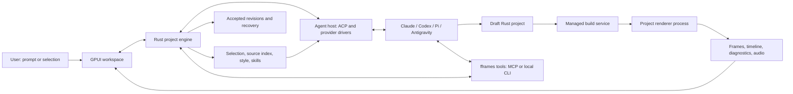

# fframes Studio: research and implementation plan

Research date: 2026-10-01. Working product name: **fframes Studio**.

Build a native GPUI app in Rust where a person describes a video, watches it, selects a scene or visible object, and asks a coding agent to change it. The agent edits an ordinary fframes Rust project. The app owns project setup, style presets, agent connections, compilation, preview, validation, history and export.

This direction follows the requested agent-driven authoring workflow. It supersedes the earlier proposal to make template parameters the primary project model. Templates are useful starting points; Rust source remains the authority for the video.

Read the documents in this order:

1. [Research findings](research.md): what Zeron, Cap, ACP and the current fframes implementation establish, with source references and limitations.
2. [Product and technical architecture](architecture.md): user workflow, process boundaries, project format, selection-to-code retrieval, style presets, preview and recovery.
3. [Implementation plan](implementation-plan.md): ordered milestones, concrete work items, acceptance criteria, release matrix and unresolved decisions.

## Proposed experience

The user installs Studio, connects a coding agent, chooses a style preset, and writes “Make a 30-second announcement for this product.” Studio creates a normal Rust video project and passes the brief, assets, selected style and fframes guidance to the agent. Once the result compiles and passes basic inspection, the preview and timeline update.

The user selects the title at 4.2 seconds and writes “Make this smaller and animate it from the left.” Studio captures the selected scene/object, frame, screenshot, source references and relevant style tokens. The agent retrieves the relevant Rust implementation, edits it in a draft workspace, and Studio validates the candidate. The result becomes a new revision with a one-click Undo. Export renders the accepted revision through the same backend used for preview.

The UI should show **what is changing** and **which version is on screen**. “Agent finished” and “video ready” are separate states: the app must still build and render the result.

## Architecture at a glance

## Decisions recommended now

| Area                  | Recommendation                                                                     | Reason                                                                                    |
| --------------------- | ---------------------------------------------------------------------------------- | ----------------------------------------------------------------------------------------- |
| Authoring model       | Ordinary Rust fframes projects                                                     | Preserves existing capabilities and lets agents edit real source                          |
| Native UI             | GPUI plus its platform entry point, in a separate desktop workspace                | Fits the requested Rust UI while keeping the core dependency graph manageable             |
| Agent integration     | ACP v1 baseline behind an app-owned agent interface                                | Supports interoperability and leaves room for native provider drivers                     |
| Rendering             | Compile a project-specific renderer executable and run it outside the GPUI process | The app cannot load arbitrary new Rust video implementations through today's generic APIs |
| First selection scope | Project, scene and time range                                                      | Existing timeline reports can support this before element source mapping exists           |
| Element selection     | Stable IDs, frame-specific metadata and source anchors                             | Makes “change this” reproducible; screenshots alone are ambiguous                         |
| Presets               | Versioned tokens, design guidance, fonts, assets and examples                      | Combines consistent values with instructions agents can follow                            |
| Preview               | Reuse a persistent renderer; preserve the last successful revision during builds   | Keeps incomplete agent edits from interrupting playback                                   |
| Installation          | Signed app plus a managed build SDK and explicit agent connection                  | Hides setup commands while acknowledging compilation and authentication requirements      |

## Work that determines feasibility

Three short experiments should precede a broad editor implementation:

1. Compile agent-written fframes source on a clean machine using an app-managed SDK. Establish what compiler, linker, native libraries and OS SDK components are actually required on each target.
2. Display frames from a persistent project renderer in GPUI, with scrubbing, bounded memory and a clear pixel/alpha format contract.
3. Complete one real agent edit over ACP: stream updates, handle permission/input, detect completion, cancel, compile the changed project, and show the result.

The source-selection experiment follows immediately: assign stable IDs to a small scene and prove that selecting an object retrieves the exact source region that produced it.

This package is a researched design and implementation backlog. It does not claim that the desktop app, provider compatibility, managed SDK or installers have been implemented or tested.
