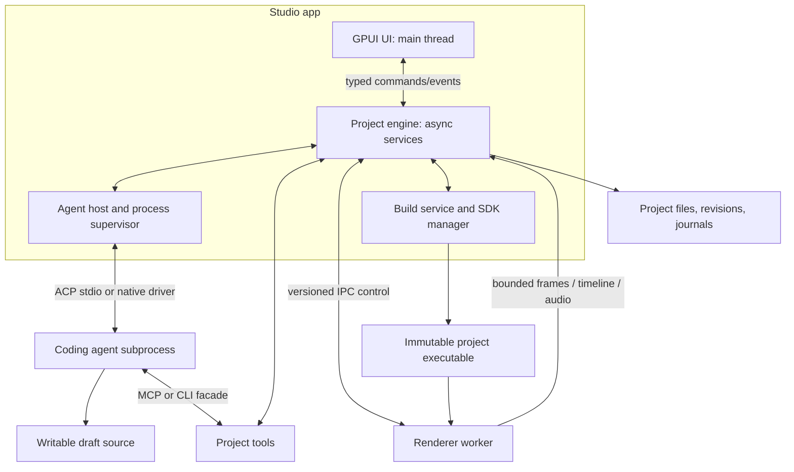
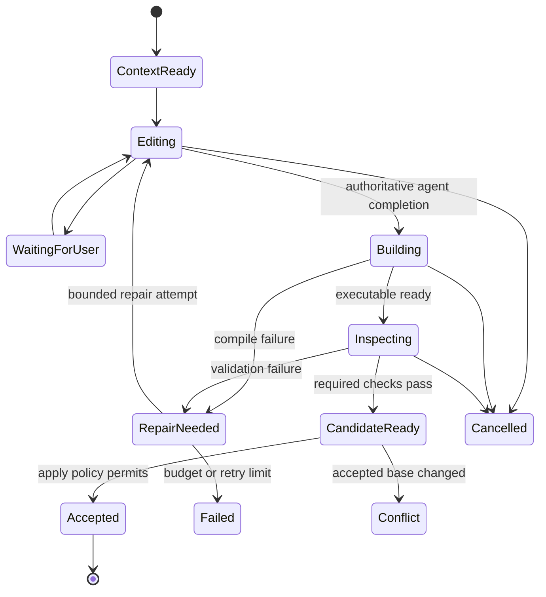

# Product and technical architecture

This is a proposed architecture based on the [research findings](research.md). Unless explicitly marked implemented, types, paths and APIs below are design examples, not existing fframes APIs.

## 1. The product contract

Studio is a visual workspace for making videos with coding agents. The default experience is a brief, an agent conversation, a preview and a timeline. A user can work without reading Rust; the resulting project remains understandable and editable as Rust.

The app owns the authoring loop:

**Brief or selection → grounded task → agent source edit → compile → inspect → preview → accepted revision → export.**

Templates seed source, assets and editor metadata. They do not restrict the user to a fixed set of template parameters. A code/diff drawer is available for advanced users but does not dominate the workspace.

### Main workspace

```text
┌ Project name · agent/model · revision/build status ───────── Export ┐
│ Project / assets │                  Preview               │ Agent │
│ Scenes           │          canvas and selection          │ chat  │
│ Style presets    │                                       │       │
│                  │ Play / pause / frame / time / zoom      │ Scope │
├──────────────────┴───────────────────────────────────────┤prompt │
│ Timeline: scenes · audio · selected range · diagnostics   │       │
└───────────────────────────────────────────────────────────┴───────┘
```

The scope above the composer reads, for example, **Title · Intro · 4.2s**, **Scene: Outro**, or **Whole video**. A selected scope can be removed or expanded before sending. During a build, the preview identifies the last successful revision; a new candidate appears only once it is ready.

### Core workflows

| Action        | User-facing behavior                                 | Engine responsibility                                                      |
| ------------- | ---------------------------------------------------- | -------------------------------------------------------------------------- |
| Create        | Choose format/preset, add assets, describe the video | Scaffold Rust project, resolve style, submit agent task                    |
| Prompt edit   | Select project/scene/range and describe a change     | Freeze context, stage edits, validate and create revision                  |
| Canvas edit   | Click a supported element, then prompt               | Resolve frame-specific ID/source ownership and attach evidence             |
| Preset change | Choose a preset or edit tokens                       | Update bound values and ask the agent to adapt unbound design where needed |
| Compare/undo  | View earlier video or undo the last task             | Restore an app-owned revision without discarding unrelated user changes    |
| Handoff       | Continue with a different coding agent               | Stop the previous writer and transfer grounded project/task context        |
| Export        | Choose file/quality and save                         | Render an immutable accepted revision with progress/cancel                 |

## 2. Execution boundaries



GPUI owns the only desktop UI event loop. The app's engine runs async work outside that thread and exposes typed commands/events. Blocking compilation, decoding, rendering and file indexing run in appropriate subprocesses or worker threads. ACP SDK executor requirements must be checked during the integration spike; a driver can own a dedicated executor without making the UI wait.

The project renderer is a compiled executable containing the user's concrete Video implementation, fframes and a small Studio runtime bridge. Keeping it outside the GPUI process solves the generic Rust type boundary and allows process recovery after a project panic/crash. It also avoids linking the UI's GPU stack to every project's renderer implementation.

Process separation is crash isolation, not a security sandbox. Agent subprocesses, Cargo build scripts, procedural macros and user video constructors execute code. The app must disclose the actual provider/build access policy and use OS confinement only where it has implemented and tested it.

### Workspace layout

```text
desktop/                          separate Cargo workspace and lockfile
  Cargo.toml
  rust-toolchain.toml
  crates/
    studio-protocol/              commands, events, IPC schemas
    studio-project/               metadata, source index, revisions
    studio-agent/                 ACP client, drivers, lifecycle
    studio-presets/               tokens, preset resolution/import
    studio-engine/                task, build, preview orchestration
    studio-media/                 presentation conversion and audio
    studio-ui/                    GPUI components and interaction
  app/                            fframes-studio executable
  packaging/                      icons, installers, runtime manifests

fframes-studio-runtime/            GPUI-free library in core workspace
                                  generic project worker entry point
```

The renderer bridge belongs with fframes because generated projects depend on it. The GPUI workspace uses the core libraries through their normal workspace/path dependencies where required, and pins one coherent GPUI revision. The root workspace must explicitly support the nested workspace arrangement; no GPUI dependencies should leak into existing core/CLI builds.

## 3. Project format and authority

```text
my-video/
  Cargo.toml
  Cargo.lock
  src/
    lib.rs                        Video and scene registration
    main.rs                       normal fframes CLI
    scenes/intro.rs                agent-editable scene implementation
    bin/studio_worker.rs           generated runtime bridge entry
  media/                          copied imports and embedded fonts
  style/
    tokens.json                   resolved preset values
    overrides.json                user-owned overrides
    guide.md                      design and motion instructions
    references/                   optional visual examples
  studio.json                     portable app metadata and SDK pin
  AGENTS.md                       generated project guidance
  .fframes/
    context/                      task packets, ignored
    cache/                        derived indices/thumbnails, ignored
```

App data outside the project stores managed SDKs, adapter installs, active draft workspaces, session journals and revision objects. Authentication credentials belong to provider-managed storage or OS credential facilities, not portable project files.

| Data                                                | Authority                                                           |
| --------------------------------------------------- | ------------------------------------------------------------------- |
| Scene layout, animation, timing and audio placement | Rust source plus any explicit runtime configuration it reads        |
| Active preset and local overrides                   | Style files, versioned with the project                             |
| Scene/object editor identities and source anchors   | Explicit source registration plus a revision-specific derived index |
| Timeline durations, overlaps and track positions    | Compiled renderer output                                            |
| Session transcript and build state                  | Local app journal/database                                          |
| Thumbnails, bounds and search index                 | Disposable revision-keyed caches                                    |

studio.json records project/schema ID, SDK release, entry target, preset identity/hash and display metadata. It must not invent an independent editable copy of scene durations that disagrees with Rust. An old project without editor annotations can still open with project/scene/range prompts; it should report that element selection is unavailable.

### Implemented portable foundation contracts

The GPUI-free [studio-project models](../../desktop/crates/studio-project/src/lib.rs) own portable metadata, validated relative paths and source identity. [Manifest](../../desktop/crates/studio-project/src/manifest.rs) defines `studio.json` version 1, including stable project identity, display metadata, an exact SDK compatibility digest, explicit Cargo manifest/package/worker target, asset references and instruction version. Optional canvas hints are informational; Rust remains authoritative. Parsing is read-only and checks the version before constructing typed state. Unknown versions never become writable manifests; no migrations are registered yet. Future migrations must preserve the original first.

[Source inventory](../../desktop/crates/studio-project/src/revision.rs) hashes sorted UTF-8 relative names, explicit file kinds and streamed content digests. It includes unknown durable files as well as Rust, Cargo, media, guidance and style files. Only root `.git`, root `target`, `.fframes/context` and `.fframes/cache` are excluded. Nested folders named `frames` or `target` remain source. Declared assets and Cargo entries cannot live in excluded trees. Links, special files and nonportable names return corrective errors. Unix file opens use held directory descriptors and no-follow opens for every descendant component. Windows rejects reparse points and checks components before and after opening; interactive platform qualification remains open.

Inventory version 1 also protects executable status, measured from the same opened file as its bytes. Readers verify both historical unversioned hashes without rewriting immutable manifests. Byte-only legacy hashes cannot authorize executable restoration or prove an unchanged relocated source with executable files; their recorded bytes remain exportable.

[ProjectState](../../desktop/crates/studio-engine/src/state.rs) belongs to one open-project controller. A fresh `OpenSession` identifies each open, including reopen. Current source, accepted checkpoint, immutable proposed candidate and successful build are separate identities. A checkpoint records saved bytes, not compilation success. Jobs move from queued to running and then succeeded, failed or interrupted; cancellation requests reject completion installation until interruption is recorded.

Every completion carries project, session, base source, operation and generation. The filesystem owner must supply a freshly reconciled inventory immediately before installation and serialize source mutation with installation. A scan alone is not an atomic filesystem snapshot. Source edits advance generation, clear candidate/build identities, retain the accepted checkpoint and interrupt obsolete work. Even an edit followed by restoring identical bytes invalidates earlier operations once reconciled.

[Controller](../../desktop/crates/studio-engine/src/controller.rs) implements checkpoint/draft jobs, per-project ownership locks, source reconciliation and interrupted recovery. A synced append-only intent/commit journal is the lifecycle authority; SQLite stores its transactional projection, recents and SDK selection. Immutable manifests reference streamed, verified content-addressed objects outside source. Truncated journal tails are preserved separately; interior corruption stops recovery. Recovery preserves external edits and accepted/draft identities. Explicit restore exports an independent copy instead of replacing the current checkout. Agent validation/promotion/Undo remain later work.

Failed scans and identity mismatches invalidate derived state and interrupt old operations before history writes, so repairing identical source cannot resurrect a stale result. Recovery inventories update source only after project identity matches and never count as successful reconciliation. Startup/capture failures settle queued or running work without changing accepted. A committed record reaches memory before SQLite projection; write failures report recovery requirements. The shell exports the selected immutable checkpoint independently of current-source validation. Root and scoped process managers serialize spawn/publication, cleanup and terminal shutdown through a shared lifecycle lock; scoped cleanup preserves unrelated children and root ownership of cleanup survivors.

[Lifecycle](../../desktop/crates/studio-project/src/lifecycle.rs) creates a portable ordinary Rust crate or imports by publishing a sidecar without rewriting source/Git/instructions. [Build materialization](../../desktop/crates/studio-engine/src/build_materialization.rs) binds captured Cargo files to the exact managed SDK in a separate tree, with isolated config/lock/target and workspace-root build cwd. Unsupported external dependencies/configuration produce diagnostics. The [native shell](../../desktop/app/src/studio_shell.rs) owns a serialized background backend and bounded immutable presentation; filesystem notifications are hints, with revision checks before completion. Terminal process-owner shutdown rejects late background spawns. Project/asset/recovery/SDK controls are functional; preview, timeline, agent editing and preset regions remain honest empty states.

For desktop-created templates, prefer runtime media loading for large/changing files and runtime style loading in the video constructor. Existing include_media_dir! projects remain supported, with an explicit rebuild after embedded assets change.

Project import preserves pre-existing dirty files and Git history. Desktop-managed checkpoints should use app-owned snapshots or a private history store; Undo must not use a blanket git reset --hard on a user's checkout.

## 4. Agent integration and handoff

### App-owned interface

Each driver exposes discovery, authentication status, session creation/restoration, prompt submission, cancellation, supported options and an event stream. Normalize events such as:

```text
SessionReady
MessageDelta
ToolStarted / ToolUpdated / ToolFinished
PermissionRequested / InputRequested
ConfigUpdated
PromptFinished { reason }
AgentActivityChanged
ProcessExited / ProtocolError
```

Keep provider ID, session ID, task ID and sequence numbers on events. Retain raw diagnostic detail locally with credentials redacted. Transcript rendering should be virtualized and batched so token streaming cannot stall video playback.

ACP v1 is the initial generic driver. Prefer the official Rust SDK for wire types/framing and own the subprocess supervisor separately. Native Claude/Codex/Pi drivers are optional implementations behind the same interface, activated when provider qualification shows a concrete missing behavior.

### Capability-driven behavior

Display model/config options advertised by the agent. Use image content only when supported, embedded resources only when supported, and session restoration only when supported. For scoped tasks, negotiated image-capable agents receive bounded PNG blocks; otherwise they receive text artifact references with a visible limitation. The native review panel can still display locally decoded, bounded thumbnails independent of ACP image support.

The app may initially decline optional ACP filesystem/terminal client capabilities and let the provider use its own workspace tools, as Zeron does. Add host-mediated operations only when they provide a tested benefit; implement path checks, output limits, cancellation and process ownership before advertising them.

### Session and writer ownership

Allow one active agent writer per project. Use a stable, app-owned draft workspace path for a persistent provider session, so session restoration does not silently change its working directory. Before a new task, reconcile that workspace to the accepted revision and deliver a context refresh. If the provider cannot safely refresh/reset context, start a new session.

An agent switch is a controlled handoff:

1. Cancel the old task or wait for its explicit completion; reap owned processes and close pending requests.
2. Choose whether the new agent continues the captured draft or starts from the accepted revision. Preserve both versions until the user chooses.
3. Create a session for the new provider with the same project instructions, selection, style, current source, previous outcome and open problems.
4. Record that conversation state/model-specific memory has not transferred. Store the outgoing session for later access.

Queued follow-up prompts wait for the current writer. Mid-turn steering is an optional provider capability, not the baseline for editing transactions.

### Implemented native workflow (M3 Stage 4, local development)

`AgentWorkflow` (`desktop/app/src/agent_workflow*`, GPUI-free) is the per-project owner of the task lifecycle above; the shell hosts it through `conversation_panel/host.rs`. The shell's `Backend` holds the `Controller` in an `Arc<Mutex<_>>` shared with the workflow, which locks it only for short engine calls and for capture and publication on its own job threads; the UI thread only `try_lock`s it. Everything blocking (log replay, adapter RPC, hashing, compile, inspection, history reads) runs on the actor, job or open threads. The workflow publishes immutable `Arc<WorkflowSnapshot>`s (rows are `Arc`-shared so a view diffs by pointer) and wakes the frame loop through an inbox; commands only enqueue. The panel (`conversation_panel.rs`) renders snapshots with `gpui::list` (visible rows plus a bounded overscan); `conversation_panel/rows.rs` turns a snapshot into list operations (in-place re-measure for updated cards and streaming text, splices for appended, evicted and paged-in rows) and composes paged history under the same 400-row / 4 MiB bound the workflow itself keeps; `controls.rs` derives which controls exist per state, provider-owned setup guidance, reply correlation and key routing as pure functions.

A commit reaches playback through `PreviewHandoff`: the workflow thread queues `PromotionHandoff { promotion, staged }`, the UI thread calls `StudioShell::adopt_promotion`, answers with `report_handoff`, and reports `preview_displayed` when the matching preview is installed. The accepted source is labelled as awaiting its preview until then; only committed engine events change acceptance. Nothing that owns a process is ever reaped on the UI thread: superseded, rejected, stale or cancelled staged previews, build scopes and displayed workers go to the background `teardown` owner (a bounded, non-blocking hand-off; the coordinator fences the build under its mailbox lock first, so a result from a build being torn down can never be applied, and problems come back as reports the frame loop shows). The install commit holds the controller's non-blocking guard from the final `can_install` check through the coordinator commit and the preview-state install, so a workflow publication or a reconcile cannot interleave (a busy controller defers the install), and a command's fresh presentation cancels only preparation that is obsolete under the state it returns: the preparation adopted for the matching current promotion survives a racing Refresh, and a presentation older than what the shell knows replaces nothing. Project open, close and replace close the workflow first; the shell never starts an agent. Authenticated-provider behavior (writer process-group model, repair with a real adapter, MCP/CLI support, restart recovery with a real account) is **not** qualified; see [phase-zero-feasibility.md](phase-zero-feasibility.md#m3-agent-transaction-qualification) for the ledger and its limits.

### Implemented M6 provider profiles, handoff and session continuity (development only)

`conversation_panel/host.rs` loads the versioned, app-local `provider-registry.json` (migrating the legacy adapter config when needed); the registry stores profile definitions and the selected profile, never credential values. Built-in Claude, Codex, Pi and Antigravity entries remain experimental. The picker and Setup report readiness separately from qualification and do not start an adapter merely because a project opens or a profile is selected. The existing custom/legacy adapter path remains available.

Handoff is owned by the existing per-project workflow actor. It retains queued briefs while the outgoing writer is stopped, closes old capabilities and verifies process-scope teardown before capturing choices. Any active publication/Undo settles before the accepted/source/draft identity is offered; the actor rechecks that identity before it creates an incoming writer. The user explicitly chooses the retained draft or accepted source, and the incoming task receives bounded context rather than an implied transfer of native conversation memory. The session manifest is app-local and versioned, stores the opaque driver session ID separately from redacted presentation, and is resumable only when project/draft identity, source/accepted revisions, and the resolved executable/argument/auth-name launch digest still match. Unsupported, changed or unsafe records remain retained but cannot be resumed; the panel offers a fresh session or dismissal. These code paths have fixture and UI-contract coverage, not authentic-provider qualification.

The [M6 ledger](../../desktop/qualification/m6-results.json) is the authority for provider status. Its present ranking is insufficient evidence; it does not advertise either of the four built-ins as qualified. `qualify-m6-providers.py --mode development` records development test runs only. Its `--mode authentic` is a read-only PATH readiness inventory and neither launches adapters nor changes the ledger; authentic workflow, resource, platform and device evidence must be gathered in the operator-controlled qualification procedure. M6 CLI-backend export does not implement the later M7 native export UI or release packaging.

The ledger validator requires each passing gate to cite authentic, hash-verified evidence bound to that provider, gate, observed adapter name and non-optional launch digest, plus the measurements required by that gate. Capability objects must be complete boolean sets, and a recommendation requires the deterministic evidence ranking of at least two fully qualified providers. The app's picker reads this ledger for display only; writer containment is independently resolved against the selected launch before any writer can be trusted.

### Implemented M4 presets and scoped editing (local development, Linux x64)

- **Presets.** `desktop/crates/studio-presets` (GPUI-free) owns schema v1, typed tokens and aliases, preset → project → scene precedence, canonical hashes, bounded no-follow directory import/export with no-clobber publication, an allowlisted CSS custom-property importer with a per-declaration report, and three bundled presets (`editorial`, `pulse`, `quiet-motion`).
- **Project snapshot.** Applying a preset is a source-fenced durable file-set mutation (`Controller::apply_preset`), recorded as `TransactionKind::Preset`, never as an agent task or in task history. It writes `style/tokens.json` (resolved), `style/overrides.json` (user-owned, preserved on reapply; only an explicit reset clears it), `style/guide.md`, `style/preset.json` and flat `media/preset-*` fonts/images, because `MediaDirectory::read_folder` reads only top-level files. Mutation is enabled on Linux x86_64 only; other platforms stay disabled until their publication and recovery probes run.
- **Runtime.** `fframes::Styles` (feature `styles`) parses the resolved JSON once in the video constructor; generated projects load it with `include_str!`. The generated scaffold and two-preset relocation render pass on a locally assembled managed SDK built from this checkout without an overlay; this is development evidence, not a published SDK release.
- **Scoped tasks.** The timeline selection (whole project, scene instance, half-open frame range) is frozen into the task context with its project/source/preview identity, overlap and boundary frames, active style snapshot and bounded exact scene-name source candidates. A queued scope whose displayed preview changes is marked stale and refused, never remapped. Before evidence is rendered from the frozen base revision and after evidence from the validated candidate as app-owned artifacts released with the task. Negotiated ACP image capability receives a bounded image block for each prompt artifact; unsupported capability falls back to task-owned artifact ids, hashes and frame indexes in text, never inline base64. The native review panel separately decodes at most six task-owned PNGs / 8 MiB of encoded data into small before/after thumbnails; decoded handles stay in presentation-only state, outside serialized snapshots. Candidate validation adds the selected and adjacent boundary frames and still broadens for shared Rust/Cargo/style/media or uncertain changes.
- **Evidence limits.** Development gates ran on native Linux/Xvfb with the scripted ACP peer; they do not qualify a real provider, physical display/audio, Windows or macOS. The evidence preview count is aggregate-only telemetry; no artifact ids, paths or pixels are logged. See `desktop/qualification/m4-results.json`.

## 5. The edit transaction

Agent edits are draft changes until validated. The default requested edit can apply automatically after validation, with Undo and comparison available; an optional review setting can require Apply. Permission to edit a project should not create a separate confirmation for every ordinary task.



The task freezes a base revision, assets/style revision and user selection. After the agent stops writing, take an immutable candidate snapshot before building it. Do not compile/render changing source while a task is still in progress unless explicitly labeling it as an unvalidated live draft.

Validate compilation, scene/timeline availability, critical diagnostics and representative frames. Inspect the selected range and neighboring boundaries; when shared functions change, broaden coverage to affected scenes. Audio changes require appropriate loudness/placement checks. The app can send bounded repair tasks with structured compiler/inspection output; expose the retry count and allow Stop.

Promotion checks that the accepted base still matches the task's base. Apply a journaled file set with content-hash conflict checks; if unrelated edits occurred, perform a safe merge or show a conflict. Multi-file promotion is a recoverable transaction, not a claim that ordinary filesystem writes are globally atomic.

Associate the revision with its prompt, changed files, preset hash, SDK version, build artifact and validation report. Export always names a specific accepted revision; background prompts do not change an active export.

## 6. Selection and source retrieval

### Start with scopes that already have evidence

The first version supports whole-project, scene and absolute time-range selection. Convert UI seconds into the current video's integer frame domain and use half-open ranges [start, end). Show overlapping active scenes and let the user choose one or both rather than assuming a single scene at a crossfade.

A timeline selection is an editing scope, not a guarantee that only those frames can change. Editing a shared animation/helper or retiming a scene can affect later frames. Context retrieval and validation must account for those dependencies.

### Stable identities for element selection

The opt-in editor contract is implemented by `Video::editor_instance_key`,
`Scene::editor_instance_key`, and `fframes::EditorObjectKey`. A registration starts with
`EditorObjectKey::new(scene_instance, component, object, repeat)`, with all four nonempty,
printable, bounded author keys. Apply `.with_source_anchor("src/lib.rs", "render_frame",
Some("unique-marker"))` only for an explicit source hint, and `.with_style_tokens([...])` only
for registered token bindings. `render_id()` produces a reversible SVG ID; annotate a rendered
group with it. The generated starter does this once in `StudioVideo::new` and reads resolved
style fields in `render_frame`. Content, typography, paint order and position do not define the
identity. Repeated instances require distinct repeat keys. An absent anchor is normal and never
implies that the application knows the source span.

The renderer converts these IDs into an editor index plus frame-specific object geometry. The
scaled-frame response carries metadata atomically with the image: its envelope supplies the
complete `PreviewIdentity` and request ID; metadata names the frame/seek, full video-pixel
dimensions, identity-index and geometry digests, parent, optional anchor/token bindings, bounds,
paint order and `ExactBounds` / `ApproximateBounds` / `Unsupported` support. Worker negotiation
adds `editor_frame_v1` as an optional capability, so older M2 workers continue image/audio
preview while exact-object selection remains unavailable. The current contract caps each frame
at 4,096 objects and metadata at 1 MiB. Invalid or over-limit metadata disables semantic
selection visibly instead of publishing a partial list as complete.

A lexical `static_hash` remains a rendering-cache identity. It changes with markup, can be shared
by identical subtrees and does not distinguish dynamic instances; it must never be the editor
object ID. Automatic macro source locations are not claimed: registered anchors resolve only
against hash-verified immutable project source and must identify a unique marker within the named
Rust symbol.

### Hit testing

`studio-engine::CanvasViewport` maps logical pointer coordinates through fit/letterboxing, pointer-centred zoom and pan into full-resolution video pixels. It uses the same transform for image and overlay and clamps rectangle endpoints to the painted image. `hit_test` accepts only metadata for the exact displayed frame/seek/geometry digest; topmost paint order wins, while cycling exposes overlapping objects and parent groups. A selection is retained across frames only when its full semantic tuple is present under the same preview identity. New source, a stale reply, an absent object or malformed metadata clears/refuses it; it is never rebound by display name, index or nearby bounds. Click pauses at the painted frame. Shift-drag creates a clamped nonsemantic rectangle; Escape clears the object selection. Legacy/unannotated workers preserve preview, timeline and scene/range workflows with a visible selection-unavailable reason.

Bounding-box selection is approximate for non-rectangular objects. A shader/video layer is selectable as a layer; an arbitrary pixel inside it is not necessarily a separately editable object. Fall back to a rectangle/time selection with a screenshot when no semantic object is available.

### Frozen selection packet

```json
{
  "schema_version": 1,
  "project_id": "project-123",
  "base_revision": "rev-018",
  "render_generation": 24,
  "scope": "element",
  "frame": 126,
  "fps": 30,
  "scene_instance_id": "intro-01",
  "element_id": "intro.title",
  "instance_key": "main",
  "range_frames": [90, 180],
  "bbox_video_px": [160, 220, 1200, 180],
  "source_refs": [
    {
      "path": "src/scenes/intro.rs",
      "symbol": "Intro::render_frame",
      "source_hash": "sha256:example"
    }
  ],
  "style_hash": "sha256:example",
  "frame_artifact": "context/task-031/frame-126.png",
  "request": "Make this title smaller and slide it in from the left."
}
```

Frame and pixel evidence are invalidated when source/style/assets change. If metadata belongs to another generation, regenerate it or ask the user to reselect; never pass stale coordinates as an exact object identity.

### Retrieval strategy

Begin with deterministic retrieval: IDs → source anchors → containing Rust implementation → imported helpers/tokens/assets. Use a Rust syntax index and symbol/text search to gather a small relevant context set. Add vector/semantic retrieval only if actual task data shows it improves results.

For arbitrary legacy projects, type/file/text matching is a best-effort fallback. Surface uncertainty rather than pretending it is an exact source map. The agent receives retrieval results as pointers and snippets and can request full files or additional dependency context.

## 7. Style presets and design systems

A preset is a portable, versioned directory or archive:

```text
preset.json                      name, version, supported token schema
tokens.json                      typed values and semantic aliases
guide.md                         typography/layout/motion rules
fonts/                           licensed files and family metadata
assets/                          reusable images/SVGs
examples/                        reference frames and optional Rust snippets
```

Support colors, typography, spacing, radii, stroke widths, shadows where the renderer supports them, and motion tokens such as durations, stagger and easing/spring parameters. Resolve aliases and validate cycles/types/units. Store a snapshot in each project so later preset updates do not silently alter existing videos.

CSS custom properties are an **import format**. Parse a declared subset of values from a supplied CSS token block and convert it to canonical typed JSON. This does not add a browser CSS layout/cascade engine to GPUI or fframes. Report unsupported selectors, functions, units and component rules instead of inventing an approximate interpretation. Define px/rem conversion relative to declared design dimensions/base typography; keep UI display pixels separate from video coordinates.

Use precedence: preset defaults → project overrides → explicit scene/element overrides. Reapplying a preset preserves user overrides unless the user requests a reset. Store instruction text, font availability, contrast rules and examples alongside tokens; numbers alone do not describe a design system.

Prefer a typed runtime Styles accessor loaded once in the video constructor. Agents use semantic names such as color.accent and typography.title rather than copying literal values throughout scenes. A token change can refresh bound values without source rewriting; hardcoded or structural design changes still require an agent task.

Separate application chrome appearance from the video's preset. A pink brand video should not automatically make every Studio panel pink.

### Guiding different agents

Keep one canonical, versioned fframes instruction bundle and reference it in every task packet. Materialize provider-specific skill entry points only as needed and preserve user-written instruction files. ACP does not provide a universal skill-installation/discovery mechanism.

The existing skill is a starting point, but desktop instructions should route preview/build/inspection through Studio tools and explain IDs, style bindings and draft transactions. Avoid asking the agent to start a second native preview window, install packages globally, or accept snapshot baselines without review.

## 8. Preview, timeline and audio

### Bootstrap and persistent preview

For the first integration slice, Studio can build a project once and invoke its compiled CLI for timeline JSON, PNG frames, inspection and a cached draft MP4. This proves the authoring loop. It does not establish smooth interactive frame generation.

The implemented M2 path keeps the concrete Video, media provider, Previewer and CPU renderer caches alive in an immutable project worker. Its additive `--preview-worker` contract negotiates hello, timeline, scaled frames, inspection, prepared PCM/windows and shutdown; the legacy `--worker` route remains unchanged. Standard output carries bounded JSON control; pixels and PCM windows use a loopback binary transport. Optional M5 element metadata and source retrieval are described in section 6; export remains later scope.

Each message includes protocol version, project/source revision, worker generation and request ID. A paused seek is latest-wins. Reject late results from superseded requests or old renderer generations. On a successful rebuild, start a new worker, prepare its first frame, then switch atomically at the UI model level while preserving/clamping playhead and selection.

### Frame contract and memory

Define dimensions, byte stride, channel order, alpha mode, color space and frame number in the frame header. fframes' RgbaFrame is straight RGBA; other paths may produce premultiplied data. Convert into the representation expected by the pinned GPUI API once at the presentation boundary and verify with known colors/transparency.

A bounded binary transport remains the selected implementation. One render and one latest desired target coalesce playback requests; stale identity/seek serial/clock-epoch completions cannot replace the main image. Thumbnails yield to main-frame requests and use a separate completion destination. Do not send full-resolution base64 images inside ACP or control JSON. Shared memory is not required by M2.

At 1280×720, one RGBA frame is about 3.5 MiB; 30 frames per second moves about 105 MiB/s before extra copies. Use preview resolution, bounded queues, latest-wins coalescing and explicit GPUI image eviction. Zero-copy texture interop between Skia and GPUI is a later platform-specific optimization.

### Timeline authority and edits

Render the scene track and audio placements from the compiled TimelineReport. Cache thumbnails/waveforms by revision and media hash. Timeline geometry and selection logic belong in a UI-independent model, following Cap's separation.

Initially, a scene resize/reorder/trim gesture creates an agent request and ghosted pending change. The timeline becomes authoritative only after compilation produces the new report. Where future projects expose typed runtime parameters for duration/order, direct controls can update those parameters through the same revision transaction. Avoid two independent timelines with different timing rules.

### Audio and presentation clock

The worker prepares the core sequential stereo mix for an immutable revision. The app validates and retains its open PCM file and materialization lease off the UI thread. A dedicated native owner creates/controls/drops CPAL streams. A bounded positioned reader and windowed-sinc resampler feed a fixed SPSC ring; the callback only converts channels/sample formats, consumes packets, writes silence on underrun/mute, and publishes atomic timestamps. It performs no allocation, locking or I/O. Long-project streaming mix preparation remains later scope.

`PlaybackClock` maps epoch-relative submitted samples against callback/predicted playback time, clamps to submitted samples and the inclusive end cursor, and rejects stale/backward timestamps. These are predicted output times, not measured physical DAC position. Invalid timestamp backends expose an estimated-latency mode. No-device/device-loss playback uses an explicit monotonic fallback; mute continues sample consumption. Pause/seek/device changes invalidate old output and re-prime the matching first frame before resuming.

Keep the audio revision coupled to the visible renderer revision. Rebuilds preserve old playback until candidate readiness, then freeze the current mapped position, re-prime its newest seek serial and reserve a fresh output epoch before committing the worker, timeline, first frame and audio together. Cancellation/precommit failure resumes the old revision; source checkpoints do not advance. Physical output residual/pause-drain latency and other native platforms remain qualification gates in the M2 record.

Use the same selected rendering backend and fonts/media for preview and export. A tiny-skia fallback cannot reproduce Skia-only shaders; report that capability gap or use a validated Skia CPU path. GPUI acceleration and fframes renderer acceleration are separate capabilities.

## 9. Agent-facing fframes tools

Expose a narrow task-scoped MCP server and an equivalent local CLI facade:

| Tool                        | Purpose                                                   |
| --------------------------- | --------------------------------------------------------- |
| project_context             | Project revision, target format, files and active preset  |
| selection_context           | Frame/seek plus an optional complete semantic tuple and geometry-digest assertion; returns the revision-bound selected object/active scenes or an explicit unannotated/unavailable result |
| source_lookup               | A project-relative Rust path + symbol + optional unique marker, or a full object tuple with frame/seek; returns hash-bound syntax snippets, containing implementation, bounded helper candidates and uncertainty |
| timeline                    | Compiled scene/audio structure                            |
| render_frame / render_strip | Return image artifacts for a requested revision/range     |
| inspect                     | Structured diagnostics tied to frames/scenes              |
| audio_analyze / audio_at    | Mix quality and placement evidence                        |
| style_context               | An optional registered object tuple/token; returns the immutable preset/token snapshot, origin and explicit binding status (never infers a token from a literal) |
| build_status                | Current candidate artifact and compiler diagnostics       |

All nine read-only methods share one app-owned task capability and dispatcher across the GUI,
`studio-tools` and `studio-mcp`; the three selection/retrieval calls use the same project and
revision checks and reply budgets as the original six. `source_lookup` indexes only immutable,
inventory-hash-verified Rust bytes: no `rustc`, macro execution, app-local files or arbitrary
path reads. The syntax index is deterministic and bounded to 256 Rust files / 1 MiB per file /
8 MiB total; lookups return at most eight 4 KiB snippets and 32 KiB of text, with helper
exploration bounded to depth two and 32 edges. Omitted files may be read on demand only through
their immutable checkpoint object and the same per-file/hash checks. Parse failures, duplicate
markers, ambiguity, truncation, cfg/macros and non-type-resolved helper candidates stay explicit
in results. Indexes are derived per revision and capped at four entries / 32 MiB. A task's frozen
base selection remains queryable while its writer is active; draft requests continue through the
existing writer gate and never silently substitute base bytes. The agent retains its own coding
tools. fframes tools neither accept arbitrary shell commands nor provide a second unrestricted
filesystem interface.

Return image artifacts in a supported form and with size limits; include text diagnostics for providers without visual input. Project build dependencies and toolchains are managed by the app's build service, not repeatedly installed by each agent.

## 10. Installation, builds and updates

An ordinary Rust project requires a compiler, compatible crate dependencies, a linker and relevant native libraries/OS SDK pieces. Packaging the GPUI app does not remove this requirement.

Use a versioned, app-managed SDK consisting of a pinned Rust toolchain, tested fframes/runtime release, offline/vendorable Rust dependencies where practical, prebuilt Skia/FFmpeg libraries, a known codec set and a platform build configuration. Treat reuse of precompiled Rust artifacts as a cache optimization: it depends on exact compiler/features/target compatibility and is not a stable plugin format.

Phase zero must establish how macOS SDK/linker and Windows SDK/runtime needs can be satisfied and redistributed. If a fully managed native build is unavailable for a platform, show the prerequisite or offer an explicit remote-build alternative; do not advertise a terminal-free local path that has not been demonstrated. WASM compilation is an alternative research direction, but today's browser bridge and native shader/media differences mean it is not a drop-in equivalent.

Keep the installer relatively small; download the tested SDK once during guided setup, with progress, disk-size information, resumable downloads and an offline bundle option. Users should never have to run just init-repo or install Node solely for the UI. Agent adapters may need Node or another runtime; manage that separately and reuse an already installed provider when supported.

Ship verified packages for each qualified platform, with runtime libraries, fonts, icons/file associations, checksums and signed updates. Pin app/SDK/worker protocol compatibility and retain one usable previous SDK for rollback. Imported custom dependencies may require extra builds; record this as an advanced compatibility path.

## 11. Persistence and recovery

Use an app-local database for project/session metadata and an append-only task journal for lifecycle/recovery. Large media, screenshots and build artifacts stay in files with retention limits. Keep portable project settings in the project rather than only in the database.

After a crash, recover to the last accepted revision, mark unfinished agent/build/export tasks interrupted, clean up owned workers and offer the retained draft. Never treat process exit as proof that its edits compiled or were applied. Closing a window cancels/reaps jobs by default; a later background-job mode should be explicit.

Record latency/memory/build timings locally to tune the pipeline. Remote telemetry and cloud sync are separate opt-in product decisions.
