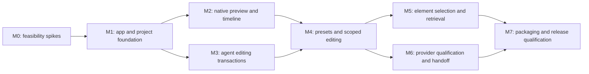

# Implementation plan

This plan implements the [agent-driven product](README.md) and [architecture](architecture.md). It is organized by evidence gates: each milestone must demonstrate a working user path before the next layer relies on it.

## 1. Scope of the first useful release

The first release should let a person install Studio, connect a qualified agent, generate an ordinary Rust video project, preview/play/scrub it, select a scene or range, request a change, apply/undo a validated revision, choose a style preset, and export an MP4.

Element selection is the next capability in the same roadmap and should ship first for annotated Studio projects. Keep a clear project/scene/range fallback for imported Rust projects.

The first release does not need cloud sync, mobile clients, simultaneous agents writing one project, arbitrary provider extensions, an advanced code IDE or zero-copy GPU integration. These can be added after the create/edit/export loop is reliable.

## 2. Dependency order

Packaging and platform build experiments begin at M0; M7 is the release gate, not the first time anyone builds an installer.

## 3. Milestones and acceptance criteria

### M0 — Prove the difficult boundaries

Execution detail: [Phase 0 desktop build, dependency setup and feasibility plan](../../plans/261001-1707-desktop-phase-zero-setup/plan.md). Its three execution stages belong to M0; they do not replace milestones M1–M7.

Create a short feasibility report and throwaway/minimal spikes rather than a complete shell.

| Experiment                 | Concrete work                                                                                                | Gate                                                                                                                           |
| -------------------------- | ------------------------------------------------------------------------------------------------------------ | ------------------------------------------------------------------------------------------------------------------------------ |
| Managed native compilation | Build a small generated Video with a pinned SDK; identify compiler/linker/native/OS SDK needs on each target | A clean user environment can compile it through an app-controlled command, or the prerequisite/fallback is explicitly recorded |
| GPUI startup               | Pin a coherent framework revision; create a basic native window and text input                               | Window, input/IME and image presentation work on the development target; build plans exist for all target OSes                 |
| Renderer worker            | Compile a project-specific executable; exchange hello/timeline/frame requests                                | Real fframes frame appears in GPUI, repeated seeks work, and a worker crash does not close the app                             |
| ACP task                   | Use one current qualified adapter with a real authenticated account                                          | Prompt streams, question/permission can resolve, cancellation reaps the process, changed Rust builds                           |
| Selection anchor           | Annotate a scene and one element; emit ID/bounds/source metadata                                             | Selecting that element returns its actual source implementation at the displayed revision                                      |

Record cold/warm build times, SDK size, frame rendering/conversion/upload time, agent startup time and unresolved platform dependencies. Do not infer compatibility from initialization alone.

**Deliverable:** a short decision record selecting the initial GPUI/ACP/SDK pins, worker transport, first agent and supported development target. If clean-machine native compilation is blocked, decide on guided OS prerequisite installation or an optional remote build before further onboarding work.

### M1 — Native shell, portable project and recovery foundation

Execution detail: [Phase 1 step-by-step foundation plan](../../plans/261002-0434-desktop-phase-one-foundation/plan.md). Its four execution stages belong to M1 and reuse the Phase 0 implementation; remaining platform and authenticated-provider qualification gates stay explicit.

Implemented and exercised on Linux X11 software rendering on 2026-10-02: native create/open/import, asset copy/relocation, SDK installation, recent/relink controls and interrupted recovery. Automated tests cover actual killed-child durability boundaries and real SDK worker builds for standalone and contained-workspace projects. This completes the development foundation, not consumer-release qualification. Checkpoints save source bytes; restore creates an independent copy and never resets the user's checkout.

Add the standalone desktop workspace, typed protocol/model crates and GPUI app. Build a workspace with project/assets/style navigation, preview area, timeline region and agent panel. Prefer standard opaque editor windows initially; decorative platform materials can wait.

Implement project create/open/import, a schema-versioned studio.json, copied media import, SDK discovery/setup status and persistent recent projects. Scaffold a normal Rust crate with the worker bridge entry and versioned project instructions. Build artifacts and app sessions must stay out of portable source.

Add a project controller with explicit source revision, accepted revision, candidate revision and job state. Store task/session metadata and draft/checkpoint files. External file changes create a new source version and invalidate caches; do not overwrite them with an agent result based on older files.

**Acceptance:** create a project, close/reopen it, relocate its folder, and reopen with imported assets intact. Invalid manifests or missing files produce actionable UI errors. A simulated interrupted job reopens as interrupted with the accepted source and retained draft available.

### M2 — Preview, timeline and audio

Execution detail: [Phase 2 step-by-step preview, timeline and audio plan](../../plans/261002-1457-desktop-phase-two-preview-timeline-audio/plan.md). Its four sequential execution stages belong to M2; they do not replace milestones M2–M5. Revision-safe CPU preview, compiled timeline controls and CPAL output-clock scheduling are implemented locally, uncommitted and unpushed. Linux X11 software rendering and virtual audio exercise the real app/SDK path; representative CLI pixels and sequential PCM agree within recorded tolerances. The [M2 qualification record](../../desktop/qualification/m2-results.json) separates resource/control evidence from pending physical output timing and platform qualification. M2 is not release-qualified.

Build on the existing Phase 0 GPUI-free runtime/protocol, binary frame transport and presentation checks, and the Phase 1 portable project, isolated SDK build, controller and recovery foundation. Continue development under the previously accepted Linux X11 evidence boundary; physical GPU/display/IME, Windows/macOS interactive and authenticated-provider qualification remain open.

| Execution stage | Deliverable | Depends on |
| --- | --- | --- |
| 1 | Validated worker negotiation, compiled reports, inspection, scaled frames and revision-bound audio preparation | M0/M1 foundation |
| 2 | Background build/preview coordination, bounded frame presentation and atomic worker replacement | Stage 1 |
| 3 | Compiled scene/audio timeline, geometry, playback controls, selection and bounded thumbnails | Stage 2 |
| 4 | App audio output, audio-clock scheduling and integrated milestone verification | Stages 1–3 |

Extend the existing GPUI-free renderer runtime and project worker, which retain the concrete Video and its media/caches. Harden worker hello/version negotiation, timeline, frame and shutdown operations, and add inspection and audio preparation. Retain the bounded binary frame transport and measure before adopting shared memory.

Build scene/audio tracks from compiled timeline reports; add play/pause, frame step, scrub, timeline zoom, range selection, overlapping-scene selection, thumbnails and time display. Put all time geometry and hit-testing arithmetic in a UI-independent module.

Add the app audio service and a matching mix for each preview revision. Keep video presentation aligned to the audio clock and drop late frames rather than drift. Worker/build replacement must reject stale generation results and preserve the last successful preview.

Separate source-sensitive build cancellation from the lifetime of the displayed immutable worker. A saved checkpoint is not proof of a successful build. Install a replacement preview only when its worker, timeline, first frame and matching audio are ready; preserve the previous preview on failure and reject superseded seeks even within the same worker generation. Keep timeline geometry in the existing GPUI-free engine and audio output in the app, without adding another UI event loop.

**Acceptance:** a real multi-scene fframes project plays with matching audio, seeks correctly while paused and playing, reaches the end cleanly, and preserves/clamps the playhead after a successful rebuild. A compile failure leaves the prior video usable. A repeated scrub/play session does not grow image/frame buffers indefinitely.

Use color/alpha reference frames to qualify conversion, and check the same representative frame through the selected preview/export backend. Include a shader example so unsupported fallback behavior is visible.

Qualification must also cover overlapping-scene selection, half-open ranges, thumbnail eviction, mute/silent/no-device playback, audio-device failure/reconnection, interrupted audio preparation, source changes during a build and project close/reopen cleanup. Use the existing CPU path initially and identify unsupported shader rendering explicitly. Compare it with the same backend through the existing frame CLI; export controls remain in M7. Record native presentation, audio timing, memory and process evidence separately from headless tests.

### M3 — Complete an agent edit transaction

Execution detail: [Phase 3 agent editing transaction plan](../../plans/261004-0730-desktop-phase-three-agent-transactions/plan.md). Its four sequential execution stages belong to M3 and reuse M0 ACP/process evidence, M1 project/checkpoint recovery and M2 immutable preview/audio coordination. Implementation and authenticated-provider qualification remain pending; the plan preserves the recorded Linux development boundary.

Implement the app-owned driver interface and ACP v1 client through the official SDK candidate. Build a process supervisor with GUI executable discovery, managed adapter paths, separate stderr handling, bounded logs, auth/setup feedback and cancellation cleanup.

Implement a streaming conversation panel with virtualized messages, tool cards, permissions/questions, provider options, explicit task state and Stop. Use authoritative protocol completion and preserve structured error details. Do not finish tasks based on silence.

Connect one agent to a stable draft workspace. Build the task packet from the brief, current source/revision, assets and fframes instructions. Freeze a candidate snapshot after agent completion, compile it, inspect it, and prepare representative preview frames. Apply according to the project's review setting; create an undoable task revision.

Provide a small tools facade for project context, timeline, frame/strip, inspect and build status. Implement MCP where the qualified provider supports it and CLI access for the same operations. Coordinate builds so app and agent tooling cannot start duplicate compilers for the same revision.

**Acceptance:** enter a brief, get a playable video, request a second edit, see the validated result, Undo, and recover the accepted revision after restarting. A deliberate compiler error yields repair context and a bounded repair attempt. Cancellation and provider/process failure leave a retained draft and no stuck writer.

### M4 — Presets and scene/range prompting

Define the versioned preset schema and canonical token types. Implement preset import/export, alias validation, project override resolution, font/media checks and project snapshotting. Add a declared CSS-custom-property import subset with an import report.

Ship two or three original example presets with noticeably different typography, layout and motion. Keep their examples/fonts/assets appropriately licensed. Add a typed runtime Styles helper and update generated project guidance to use it.

Connect scene/range selection to the task packet. Include compiled frame ranges, scene source lookup, current screenshot/strip, active tokens and nearby scene boundaries. A timeline drag can create a pending coding task with a visible scope and ghosted result.

**Acceptance:** the same source project renders in two presets using semantic tokens; local overrides survive preset reapplication and reopening. Selecting a scene/range and prompting produces an edit with before/after evidence. Shared helper changes trigger broader validation instead of assuming the selected range is isolated.

Execution detail: [Phase 4 step-by-step presets and scoped-editing plan](../../plans/261005-0715-desktop-phase-four-presets-scoped-editing/plan.md). Its four sequential execution stages belong to M4 and do not replace milestones M5–M7. Preset/scoped-editing implementation and native Linux development gates are complete, including the locally assembled managed-SDK render and before/after thumbnail review. M4 is not fully qualified: authenticated-provider, physical display/audio, Windows and macOS gates remain separate and unrun. See the [M4 ledger](../../desktop/qualification/m4-results.json); do not infer release readiness from the development evidence.

### M5 — Canvas selection and reliable source retrieval

Execution detail: [Phase 5 step-by-step canvas selection and source retrieval plan](../../plans/261006-2010-desktop-phase-five-canvas-selection-source-retrieval/plan.md). Its four sequential execution stages belong to M5 and reuse the implemented M0–M4 foundations. The Linux development implementation is complete: generated projects register stable semantic identities and explicit source anchors; displayed-frame selection and overlap/group cycling use transformed geometry; immutable syntax retrieval powers `selection_context`, `source_lookup` and `style_context`; element and rectangle scopes enter the existing validated edit/Apply/Undo workflow. Managed-SDK rendering, native X11 selection and the full development edit lifecycle are recorded in the [M5 qualification ledger](../../desktop/qualification/m5-results.json). Authenticated-provider, physical-device, Windows and macOS qualification remain separately pending; development evidence is not release qualification.

Add stable scene-instance/component/object IDs and optional source registration to desktop-generated projects. Emit a revision-specific editor index and frame-specific bounds/paint-order metadata. Prove how IDs survive SVG conversion before choosing the final macro/runtime representation.

Implement letterbox/zoom coordinate mapping, topmost object hit testing, group/overlap cycling and source-ref lookup. Begin with explicit source anchors and semantic IDs; add automatic macro spans only after their accuracy and stability are demonstrated.

Add a deterministic Rust syntax/symbol retrieval index for containing implementations, imported helpers, asset references and token bindings. Extend tools with selection_context, source_lookup and style_context. Bound attached snippets/images and allow the agent to request more context.

**Acceptance:** click a title, prompt a change, and retrieve/edit that title's implementation. Cover repeated scene types, repeated SVG elements, group transforms, crossfades, shared helpers and deleted IDs. A late/stale frame cannot select an object from the wrong revision. Unsupported objects fall back to a scene/rectangle prompt with visible scope.

### M6 — Qualify providers and implement handoff

Execution detail: [Phase 6 provider qualification and controlled handoff plan](../../plans/261007-0712-desktop-phase-six-provider-qualification-handoff/plan.md). Its three sequential execution stages belong to M6 and reuse the implemented M0–M5 development foundations. Provider profiles/evidence contracts, controlled handoff/restoration and the native picker are implemented in the current workspace. The [M6 ledger](../../desktop/qualification/m6-results.json) advertises no qualified connector or best-two recommendation; authentic, physical-device and platform gates remain open. M6 uses the existing CLI for export evidence; native export controls and consumer qualification belong to M7. Historical plan status is not current qualification evidence.

Qualify Claude, Codex, Pi and Antigravity through their current ACP distribution. Record adapter/CLI version, OS, auth path, capability negotiation, completion, cancellation, restoration, visual context and MCP/CLI tool access.

Start with the two providers that pass the full Studio workflow most reliably. Keep the other connectors experimental until they pass the same suite. Add a native provider driver only when a specific gap prevents useful editing, as Zeron's experience suggests.

Implement an agent picker and task handoff with a stopped previous writer, current project/draft revision, task summary, selection, style and unresolved diagnostics. Do not imply that provider-native conversation memory is portable.

**Acceptance:** create/edit/export with each advertised connector. Demonstrate a Claude-to-Codex or equivalent handoff with no overlapping writers and a correct retained project. Resume a supported session after app restart; unsupported restoration creates a new session with explicit project context rather than silently losing continuity.

### M7 — Installers and consumer release

Build the app, SDK/runtime packages and compatibility manifest on native CI runners. Produce signed/notarized macOS artifacts, a signed per-user Windows installer, and tested Linux packages. Include fonts and runtime libraries and verify launch from the installer rather than the build directory.

Implement guided setup for SDK download and agent detection/authentication. Handle missing prerequisites, partial downloads, disk space, interrupted installation and offline SDK reuse. The user should not need a terminal for any advertised default workflow.

Add revision-pinned MP4 export with codec/quality controls, progress, cancel, temporary output and final atomic replacement. Export failure must not leave a broken file with the final requested filename.

Add update metadata, signature/checksum verification, app/SDK compatibility checks and rollback behavior. File associations and “Open project” should work after app update. Third-party notices include the actual bundled libraries/runtimes/codecs/fonts.

**Acceptance:** on clean users/machines for each supported target, install → connect agent → download SDK → generate → select/prompt → preview → export → close/reopen works. Authentication prerequisites and network downloads are visible. App update and uninstall behavior are checked against project retention policy.

## 4. Initial engineering backlog

These are suggested issue boundaries; they are not created tickets.

| ID    | Work item                                          | Depends on          | Main area        |
| ----- | -------------------------------------------------- | ------------------- | ---------------- |
| ST-01 | SDK/compiler/linker feasibility matrix             | —                   | Build/runtime    |
| ST-02 | GPUI startup and pixel-format spike                | —                   | UI/media         |
| ST-03 | Real ACP lifecycle spike and version qualification | —                   | Agent host       |
| ST-04 | Stable ID/source-anchor spike                      | —                   | Macro/runtime    |
| ST-05 | Desktop workspace and protocol schemas             | ST-01, ST-02        | App foundation   |
| ST-06 | Project scaffold/import/persistence                | ST-05               | Project engine   |
| ST-07 | Renderer runtime bridge and supervisor             | ST-01, ST-05        | Core/runtime     |
| ST-08 | Bounded frame pump, scrub and image disposal       | ST-07               | Preview          |
| ST-09 | Timeline geometry/tracks/thumbnails                | ST-07, ST-08        | UI/project       |
| ST-10 | Audio preview and revision handoff                 | ST-07, ST-08        | Media            |
| ST-11 | Agent driver abstraction and setup UI              | ST-03, ST-05        | Agent/UI         |
| ST-12 | Draft/build/validation/promotion transactions      | ST-06, ST-07, ST-11 | Engine           |
| ST-13 | Task journal, recovery and safe Undo               | ST-12               | Persistence      |
| ST-14 | MCP/CLI project tools                              | ST-07, ST-12        | Agent tools      |
| ST-15 | Preset schemas, CSS import and runtime styles      | ST-06               | Presets/runtime  |
| ST-16 | Scene/range task context                           | ST-09, ST-12, ST-15 | Editing          |
| ST-17 | Element metadata and GPUI hit testing              | ST-04, ST-08        | Source selection |
| ST-18 | Rust source retrieval and context packets          | ST-17, ST-14        | Project tools    |
| ST-19 | Provider matrix and controlled handoff             | ST-11, ST-12, ST-14 | Agent host       |
| ST-20 | Installer/SDK packages and native CI               | ST-01, ST-06        | Release          |
| ST-21 | Export queue, cancellation and output recovery     | ST-07, ST-12        | Runtime          |
| ST-22 | Clean-machine qualification and update rollback    | ST-19, ST-20, ST-21 | Release          |

## 5. API changes to keep small

Start with additive APIs:

- A GPUI-free Studio runtime entry point for project-specific workers.
- A small public renderer/report boundary where existing APIs are sufficient.
- Optional editor annotations/sidecar metadata, avoiding mandatory changes to every Video implementation.
- A typed Styles helper for desktop-created projects.
- An app scaffold variant that adds the worker entry and instructions.

Keep timeline output and diagnostics backward-compatible where possible. Use a separate versioned worker schema when app-specific identities/metadata exceed the existing CLI report format. Preserve today's CLI for imported projects and for the local tool fallback.

Do not refactor the rendering engine or browser editor simply to create a desktop shell. Each core change should have a demonstrated consumer in a spike/milestone.

## 6. Verification plan

| Area              | Meaningful checks                                                                                                           |
| ----------------- | --------------------------------------------------------------------------------------------------------------------------- |
| Agent lifecycle   | Out-of-order responses, streamed updates, long quiet periods, permission/input, EOF, errors, cancel and owned child cleanup |
| Task transactions | Candidate hashes, external edits, file conflicts, bounded retries, cancellation and interrupted promotion recovery          |
| Rendering         | Known channel/alpha colors, matching preview/export frames, worker crash, shader capability and media/font availability     |
| Selection         | Coordinate transforms, overlapping scenes/objects, repeated IDs/instances, changed source spans and stale generations       |
| Presets           | Alias cycles, invalid types, units, missing fonts, preserved overrides and immutable project snapshots                      |
| Timeline/audio    | Frame rounding, half-open ranges, overlaps, seek/end behavior and matching audio revision                                   |
| Resources         | Repeated scrub, long playback, project close/reopen, image eviction, queue bounds and subprocess count                      |
| Installation      | Clean user accounts, packaged runtime layout, offline reopen, SDK download interruption, update and rollback                |

Use protocol/process fixtures for deterministic failure cases and real authenticated provider smoke runs for connector claims. A fake agent passing unit tests cannot establish actual provider compatibility.

For Rust code changes, run scoped checks, formatting and appropriate tests, then the repository's required Clippy gate before committing. Validate impacted WASM compilation when touching shared/editor bridge APIs. Package checks should use representative small projects instead of rebuilding all examples on every UI change.

### Proposed performance targets

Treat these as engineering targets pending M0 measurement, not current results:

- A bounded preview frame queue and image cache with no continuous growth during a 10-minute playback/scrub exercise.
- Cached paused-seek response under roughly 150 ms on a named reference machine; expensive uncached frames show progress and can supersede old requests.
- Smooth 30 fps preview for a simple 960×540 reference project, with audio synchronization and explicit frame dropping on overloaded scenes.
- Streaming agent transcript and compilation do not block pointer/text interaction.
- Warm edits reuse compiler/renderer caches; report build latency separately from model latency rather than promising a fixed total edit time.

Final thresholds should come from measured user tasks and include source/media complexity, backend, SDK version and machine specification.

## 7. Platform qualification

| Target                                    | Initial role                             | Release evidence needed                                                                                   |
| ----------------------------------------- | ---------------------------------------- | --------------------------------------------------------------------------------------------------------- |
| macOS Apple Silicon                       | Primary consumer target                  | GPUI/Metal window, managed native build prerequisites, signing/notarization, audio and codecs             |
| Windows x64                               | Primary consumer target                  | GPUI presentation, native linker/SDK strategy, Vulkan or qualified renderer fallback, DLL layout, signing |
| Linux x64                                 | Development and qualified desktop target | GPUI X11/Wayland, GPU/CPU behavior, font/audio dependencies, portable SDK and AppImage/deb installation   |
| macOS Intel / Linux arm64 / Windows arm64 | Later target expansion                   | Native build/package and provider/runtime qualification on those architectures                            |

The current repository's Windows CI checks a subset of core crates and a render smoke path. It is not evidence that a GPUI editor, Skia preview, managed compiler or all examples already work on Windows.

Ship platforms as they pass the same functional gate. Build success on a runner and screenshot success are insufficient for promising installation, editing and export.

## 8. Planning envelope and decisions

Do the feasibility spikes first; they determine the build/SDK strategy and may change the schedule substantially. A rough planning envelope for two engineers is 1–2 weeks for spikes, 4–6 additional weeks for a useful one-agent create/edit/preview prototype, and another 6–12 weeks for source selection, broader providers and qualified packages. This is an initial estimate, not a delivery commitment; full Linux/platform parity or an SDK redistribution blocker can extend it.

Before implementing the first milestone, record these decisions:

| Decision                               | Proposed default                               | What can change it                                               |
| -------------------------------------- | ---------------------------------------------- | ---------------------------------------------------------------- |
| Rust source or constrained project DSL | Rust source                                    | User explicitly requests a different authoring model             |
| First provider                         | Best current ACP adapter from M0 qualification | Authentication/setup burden or lifecycle failures                |
| Compilation                            | Local managed SDK                              | Clean-machine feasibility or platform redistribution constraints |
| Agent-applied changes                  | Apply after required validation, with Undo     | User enables manual review                                       |
| Object selection                       | Explicit semantic IDs first                    | Macro/source span experiment proves reliable automatic capture   |
| Remote sync                            | Deferred                                       | Demonstrated need for multi-device work                          |
| Hosted build/agent service             | Optional later                                 | Local setup proves too heavy for the intended users              |

The first concrete implementation target is a small GPUI window with one generated Rust project, one qualified agent, one style preset, a working preview/timeline, and an undoable select-scene-and-prompt edit. That vertical slice tests the product's central loop before broad editor features are added.
